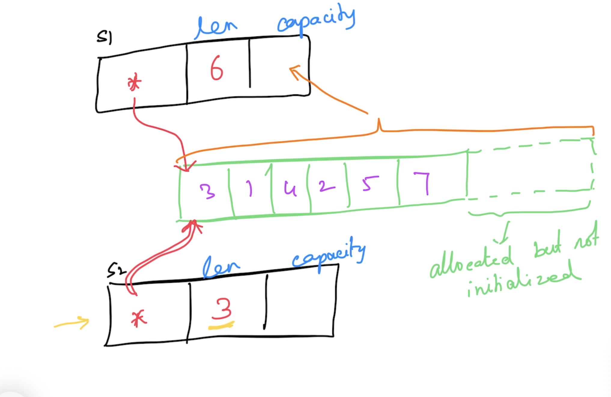

# Go Foundation

## Magesh Kuppan

## Schedule
- Commence      : 9:00 AM
- Tea Break     : 10:30 AM (20 mins)
- Lunch Break   : 12:30 PM (1 hour)
- Tea Break     : 3:00 PM (20 mins)
- Wind up       : 5:00 PM

## Agenda
- Day-1
    - Language Introduction
    - Data Types
    - Programming Constructs
    - Functions 
        - Higher Order Functions
        - Deferred Functions
- Day-2
    - Errors
    - Panic & Recovery
    - Pointers
    - Collections
        - Array
        - Slice
        - Map
    - Modularity
        - Packages
        - Modules
    - Structs
        - Struct Composition
- Day-3
    - Methods
        - Method inheritance
    - Type Assertion
    - Interfaces
    - Concurrency
    - Http Services (Overview)

## Methodology
- No powerpoint
- Discussion & Code

## Software Requirements
- Go tools (https://go.dev/dl)
- Visual Studio Code (https://code.visualstudio.com)
- Go extension for Visual Studio Code (https://marketplace.visualstudio.com/items?itemName=golang.Go)

## Repository
- https://github.com/tkmagesh/cisco-go-feb-2024

## Why Go?
- Simplicity
    - ONLY 25 keywords
    - No access modifiers (no public/private/protected)
    - No classes (only structs)
    - No inheritance (only composition)
    - No exceptions (only errors)
    - No 'try-catch-finally'
    - No reference types (everything is a value type)
    - No pointer arithmatic
    - No implicit type conversion
    - No function overloading
- Close to hardware (performance)
    - Compiled to machine code
    - Different builds for different platforms
    - Tooling support for cross compilation
- Managed Concurrency
    - Concurrency
        - Ability to have more than one execution path
        - Concurreny is NOT parallelism
    - Concurrent operations are represented as Goroutines (not as OS threads)
    - Built in scheduler to schedule the execution of the goroutines
    - Goroutines are cheap ( ~4KB vs OS thread ~2 MB)
    - Concurrency support is built in the language
        - go keyword, channel data type, channel operator ( <- ), range & select-case constructs
    - API support
        - sync package
        - sync/atomic package
## Concurrency using OS Threads

## Managed Concurrency in Go (Using Goroutines)

## Go Programs
### Compile & Execute
> go run [program.go]
### Compile
> go build [program.go]
> go build -o [bindary_name] [program.go]
### List the environment variables
> go env
> go env [var_1] [var_2] .....
### Set the value of environment variables
> go env -w [var_1 = value_1] [var_2 = value_2] ....
### Environment Variables for Cross Compilation
- GOARCH
- GOOS
### List the supported platforms for Cross Compilation
> go tool dist list
### Cross Compile
> GOOS=[target_os] GOARCH=[target_process_arch] go build -o [binary_name] [program.go]

## Data Types
- bool
- string
- integer types
    - int8
    - int16
    - int32
    - int64
    - int
- unsigned integer types
    - uint8
    - uint16
    - uint32
    - uint64
    - uint
- float types
    - float32
    - float64
- complex types
    - complex64 (real[float32] + imaginary[float32])
    - complex128 (real[float64] + imaginary[float64])
- type aliases
    - byte (alias for uint8)
    - rune (alias for int32 / unicode code point)

## Variables in Go
- Function Scope
    - Can use "var" & ":="
    - CANNOT have unused variables
- Package Scope
    - CANNOT use ":="
    - CAN have unused variables

## IOTA 
- constants whose values are autogenerated

## Programming Constructs
- if else
- switch case
- for
- func

## Functions
- Functions can return more than one result
- Anonymous functions
- Higher Order Functions
    - Assign functions as values to variables
    - Pass functions as arguments to other functions
    - Return functions as return values from other functions
- Variadic functions

## Deferred Functions
- functions whose execution is postponed (until the current function execution is completed)
- prefix "defer" before the function call

## Errors
- Errors are values that are returned from a function
- Error objects implement "error" interface
    - with an "Error()" method
- Creation
    - errors.New()
    - fmt.Errorf()

## Panic
- A state of the application where the application execution cannot proceed further
- The application exits when a panic occurs (by default) with status code (2)
- Use "panic()" to programmatically create a panic
- Use "recover()" to know if any panic occurred

## Pointers
- an address of data in the memory
- typed

## Collections
### Array
- Fixed size typed collection
- Memory is allocated and initialized (with zero value of the underlying type) in the declaration itself
### Slice
- Varying sized typed collection
- Pointer to an underlying array
- "len()" returns the size of the slice
- "append()" can be used to add new items to the slice
- "copy()" to create a new copy of the slice (with underlying array)

### Map
- Typed collection of key/value pairs
