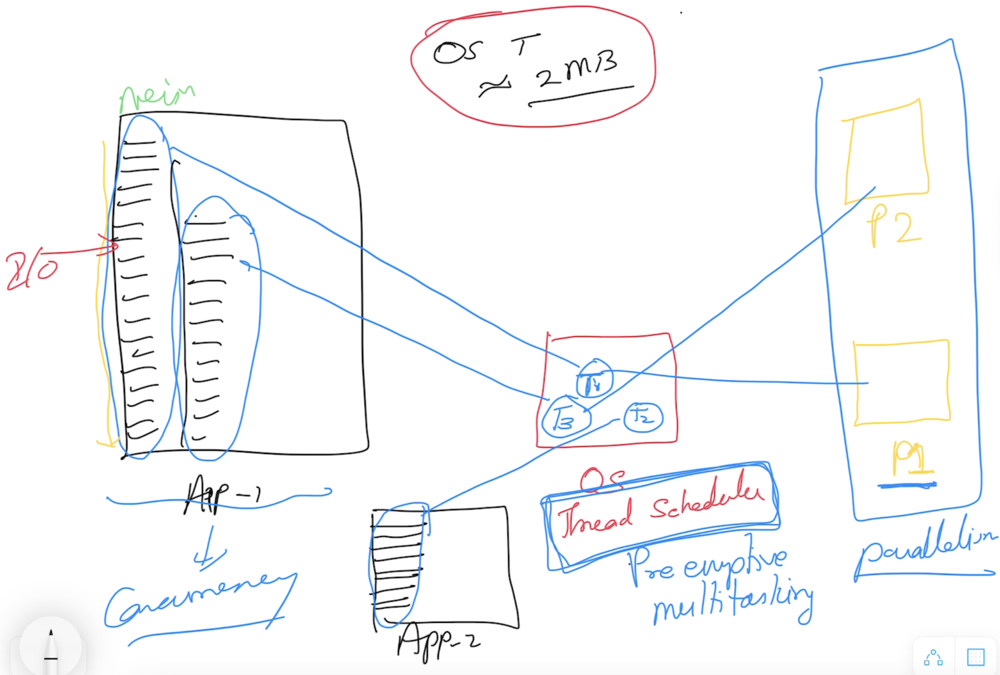

# Go Foundation

## Magesh Kuppan

## Schedule
- Commence      : 9:00 AM
- Tea Break     : 10:30 AM (20 mins)
- Lunch Break   : 12:30 PM (1 hour)
- Tea Break     : 3:00 PM (20 mins)
- Wind up       : 5:00 PM

## Methodology
- No powerpoint
- Discussion & Code

## Software Requirements
- Go tools (https://go.dev/dl)
- Visual Studio Code (https://code.visualstudio.com)
- Go extension for Visual Studio Code (https://marketplace.visualstudio.com/items?itemName=golang.Go)

## Repository
- https://github.com/tkmagesh/cisco-go-feb-2024

## Why Go?
- Simplicity
    - ONLY 25 keywords
    - No access modifiers (no public/private/protected)
    - No classes (only structs)
    - No inheritance (only composition)
    - No exceptions (only errors)
    - No 'try-catch-finally'
    - No reference types (everything is a value type)
    - No pointer arithmatic
    - No implicit type conversion
- Close to hardware (performance)
    - Compiled to machine code
    - Different builds for different platforms
    - Tooling support for cross compilation
- Managed Concurrency
    - Concurrency
        - Ability to have more than one execution path
        - Concurreny is NOT parallelism
    - Concurrent operations are represented as Goroutines (not as OS threads)
    - Built in scheduler to schedule the execution of the goroutines
    - Goroutines are cheap ( ~4KB vs OS thread ~2 MB)
    - Concurrency support is built in the language
        - go keyword, channel data type, channel operator ( <- ), range & select-case constructs
    - API support
        - sync package
        - sync/atomic package
## Concurrency using OS Threads

## Managed Concurrency in Go (Using Goroutines)

## Go Programs
### Compile & Execute
> go run [program.go]
### Compile
> go build [program.go]
> go build -o [bindary_name] [program.go]